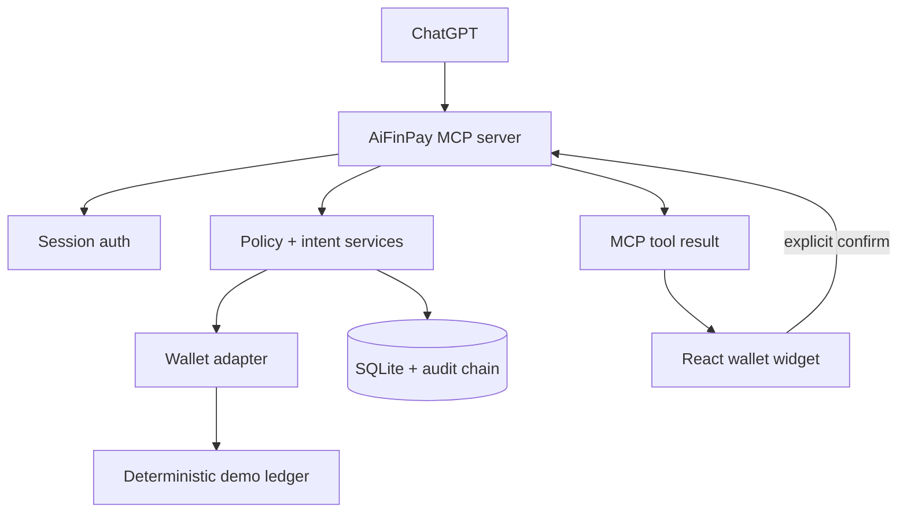

# AiFinPay Wallet for ChatGPT

> Send, receive and approve agent payments without leaving the conversation.

[](https://render.com/deploy?repo=https://github.com/coinsecuritiescompany/GPT-wallet-AiFinPay)

AiFinPay Wallet for ChatGPT is a programmable wallet and approval layer for users and autonomous AI agents. ChatGPT calls focused MCP tools, while a React widget renders balances, transfer previews, agent limits, blocked requests, receipts and the audit trail inline.

**Current scope: deterministic demo ledger and Polygon Amoy-shaped data only. Do not use real funds.**

## Problem

AI agents can call APIs and MCP tools, but payment approval is still fragmented. Giving an agent an unrestricted signing key creates unacceptable custody and replay risk. AiFinPay separates natural-language intent from authoritative policy evaluation, explicit confirmation and execution.

## What works

- Opens an inline wallet with a deterministic 2,543.68 USDC demo balance.
- Reads USDC/POL balances and transaction history.
- Validates EVM addresses and decimal amounts without floating point.
- Prepares a transfer without broadcasting it.
- Requires a signed, expiring confirmation token before execution.
- Evaluates agent daily, per-transaction, token, network, recipient and merchant limits.
- Demonstrates auto-approved, human-approval and blocked agent payments.
- Executes against a deterministic demo ledger and returns a stable receipt/hash.
- Stores payment intents, agent policies and a tamper-evident audit hash chain in SQLite.
- Enforces idempotency, ownership and payment-intent state transitions.
- Exposes 16 MCP tools plus `/health`.

## Architecture



The widget uses the MCP Apps `ui/*` JSON-RPC bridge first and keeps `window.openai` only for ChatGPT-specific extensions such as external links and display mode. See [Architecture](docs/ARCHITECTURE.md).

## Key user flows

1. **Open wallet** — `get_wallet_summary` then `render_wallet`.
2. **Send USDC** — `prepare_transfer` validates and creates a preview; `confirm_transfer` executes only with the issued token.
3. **Agent payment** — `evaluate_payment_request` returns `AUTO_APPROVED`, `HUMAN_APPROVAL_REQUIRED` or `BLOCKED` from deterministic rules.
4. **Agent limits** — preview and explicitly confirm a policy before persistence.
5. **Audit** — inspect receipt IDs and verify the local hash chain.

## Widget states

The single-file React bundle includes wallet overview, loading, not connected, transfer form, preview, signing/loading feedback, confirmed receipt, failure/error, policy blocked, agent approval, policy list, transaction history and audit log states. Run `npm run dev -w @aifinpay/wallet-widget` to view the deterministic browser preview. Capture final ChatGPT-hosted screenshots after deploying the HTTPS MCP endpoint; host screenshots are intentionally not fabricated in this repository.

## MCP tools

| Tool | Purpose | Write |
|---|---|---:|
| `get_wallet_summary` | Wallet, balances, recent activity, policies | No |
| `get_token_balance` | Token balance | No |
| `prepare_transfer` | Validated non-broadcast preview | State only |
| `confirm_transfer` | Confirm and execute prepared intent | Yes |
| `cancel_transfer` | Cancel an eligible intent | Yes |
| `get_transaction_status` | Intent/transaction state | No |
| `list_transactions` | Filtered transaction history | No |
| `create_agent_policy` | Preview, then confirm a policy | Yes |
| `list_agent_policies` | List policies | No |
| `update_agent_policy` | Enable/disable with confirmation | Yes |
| `revoke_agent_policy` | Revoke with confirmation | Yes |
| `evaluate_payment_request` | Deterministic policy decision | No |
| `get_audit_log` | Audit events and chain state | No |
| `render_wallet` | Attach wallet widget | No |
| `render_transfer_preview` | Attach preview widget | No |
| `render_transaction_receipt` | Attach receipt widget | No |

Full schemas and annotations: [MCP tools](docs/MCP_TOOLS.md).

## Security model

- No seed phrase or private-key screen exists.
- No private key is stored in the MCP database.
- The model cannot determine or bypass policy outcomes.
- Every financial amount uses integer base units.
- Mutating requests are bound to the authenticated demo user, prepared intent, expiry and confirmation token.
- Idempotency prevents duplicate preparation/submission.
- Audit records form a local SHA-256 hash chain; this is tamper-evident, not legally immutable.
- Logs exclude tokens, secrets, seed phrases and private keys.

Read [Security model](docs/SECURITY_MODEL.md) and [Threat model](docs/THREAT_MODEL.md).

## Local setup

Requirements: Node.js 22+ (Node 24 recommended) and npm 11+.

```bash
npm install
cp .env.example .env
npm run check
npm run build
npm start
```

Endpoints:

- MCP: `http://localhost:8787/mcp`
- Health: `http://localhost:8787/health`
- Public landing: `http://localhost:8787/`
- Widget preview: `http://localhost:8787/preview`
- Privacy: `http://localhost:8787/privacy`
- Support: `http://localhost:8787/support`
- Widget browser development: `npm run dev -w @aifinpay/wallet-widget`

Test with MCP Inspector:

```bash
npx @modelcontextprotocol/inspector@latest --server-url http://localhost:8787/mcp --transport http
```

## Environment

Demo mode requires only:

```dotenv
AIFINPAY_DEMO_MODE=true
DATABASE_URL=./data/aifinpay-demo.sqlite
SESSION_SECRET=replace-with-at-least-32-random-characters
```

All available placeholders are in [.env.example](.env.example). No real values are committed.

## Connect to ChatGPT

ChatGPT needs a public HTTPS endpoint during development. Build/start the server, expose port `8787` using a tunnel, then create a developer-mode app with the HTTPS URL ending in `/mcp`. Current exact terminology and refresh steps are in [ChatGPT setup](docs/CHATGPT_SETUP.md).

## Deployment

The repository includes a one-click Render Blueprint, GitHub Actions CI, a multi-stage `Dockerfile`, `docker-compose.yml`, `/health`, graceful shutdown and environment validation. Render automatically supplies the public hostname; the app derives its `/mcp` and widget URLs from it. Production use should replace SQLite/demo signing with managed Postgres and a reviewed user-controlled or HSM-backed signer. See [Deployment](docs/DEPLOYMENT.md).

## Hackathon scope

**Before Build Week:** this repository was empty. No existing AiFinPay wallet, backend, SDK, authentication or blockchain component was available here to reuse.

**Built during Build Week:** MCP server, React widget, deterministic demo ledger, policy engine, transfer intent state machine, confirmation tokens, SQLite persistence, audit hash chain, tests, container setup and submission materials.

**Codex contribution:** repository audit, docs-first Apps SDK implementation, code, tests, error fixes, security documentation and Devpost copy. See [Build log](docs/HACKATHON_BUILD_LOG.md).

## Commands

```bash
npm run lint        # ESLint
npm run typecheck   # all workspaces
npm test            # unit/integration/widget/security tests
npm run build       # packages, single-file widget, MCP server
npm run check       # complete local verification
```

## Known limitations

- Demo ledger only; explorer links are illustrative Polygon Amoy-shaped receipts.
- Production OAuth/account linking is documented but not enabled in demo mode.
- Production signing, real RPC submission, gas estimation and confirmations are not implemented.
- SQLite uses Node's built-in API, which Node currently marks experimental.
- A live deployment and final ChatGPT-hosted screenshots are still submission blockers until the repository owner approves a hosting deployment.

Full list: [Limitations](docs/LIMITATIONS.md).

## Legal and safety

Demo/testnet only. No seed phrases or private keys are exposed. This software has not been audited for production custody, is not ready for real user funds without a production security review, and is not financial advice.

## License

MIT — see [LICENSE](LICENSE).
