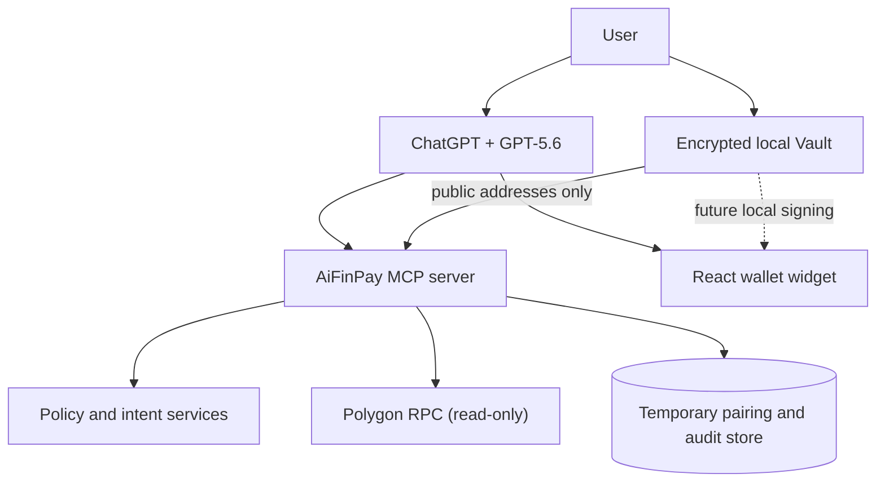

# AiFinPay Wallet for ChatGPT

<p align="center">
  
</p>

<p align="center"><strong>A non-custodial wallet interface and programmable approval layer for people and AI agents.</strong></p>

<p align="center">
  <a href="https://github.com/coinsecuritiescompany/GPT-wallet-AiFinPay/actions/workflows/ci.yml"></a>
  <a href="LICENSE"></a>
  <a href="https://aifinpay-wallet-chatgpt.onrender.com/health"></a>
  
</p>

> [!IMPORTANT]
> This public repository is a transparent hackathon/reference implementation. Polygon balances are live and read-only. Mainnet transaction signing and broadcasting are deliberately disabled until per-user authentication, durable storage and reviewed local signing are complete. Do not treat this beta as a bank, exchange, custodian or financial adviser.

## Try it

- [Product page](https://aifinpay-wallet-chatgpt.onrender.com/)
- [Widget preview](https://aifinpay-wallet-chatgpt.onrender.com/preview)
- [MCP endpoint](https://aifinpay-wallet-chatgpt.onrender.com/mcp)
- [Service health](https://aifinpay-wallet-chatgpt.onrender.com/health)
- [Privacy](https://aifinpay-wallet-chatgpt.onrender.com/privacy) · [Terms](https://aifinpay-wallet-chatgpt.onrender.com/terms) · [Support](https://aifinpay-wallet-chatgpt.onrender.com/support)

The hosted instance uses a free preview environment and can cold-start after inactivity. Judges and reviewers can test the complete connection and read-only balance flow without rebuilding the project.

## Product status

| Capability | Status | Trust boundary |
|---|---|---|
| Local 12/15-word wallet creation and restore | Beta | Recovery phrase stays in the browser Vault |
| Local AES-256-GCM encrypted Vault | Beta | Password and ciphertext remain on the device |
| EVM, Solana, NEAR and Aptos address derivation | Beta | Only public addresses are paired with ChatGPT |
| Idempotent Vault pairing and automatic dashboard opening | Beta | Repeated completion accepts only the same public addresses |
| 12-mainnet selector | Live UI | Polygon balance is live; the other network balance adapters are staged |
| Polygon PoS POL and native USDC balances | Live, read-only | Read from public Polygon RPC endpoints |
| Receive flow | Live | Displays public addresses only |
| Agent policy engine and audit trail | Reference implementation | Server-side deterministic rules |
| Mainnet transaction signing | Disabled | Requires personal auth and local user approval |
| Mainnet broadcasting | Disabled | No production transaction submission in this release |

## Why AiFinPay

AI agents can call APIs, purchase data and complete workflows, but an unrestricted wallet key is not an acceptable payment interface. AiFinPay separates four responsibilities:

1. GPT-5.6 interprets the user's natural-language intent and selects a narrow MCP tool.
2. Deterministic code validates amounts, addresses, limits and policy rules.
3. The user keeps recovery material and future signing authority in an encrypted local Vault.
4. The app returns concise structured results and a purpose-built interface inside ChatGPT.

The model can request an operation, but it cannot access recovery words or override the policy engine.

## Architecture



The monorepo contains a TypeScript MCP server, a compact React widget, a separately loaded Vault application and shared policy/schema packages. The ChatGPT widget excludes the heavier wallet-derivation libraries so it remains responsive on mobile. See [Architecture](docs/ARCHITECTURE.md) and [Public/private boundary](docs/PUBLIC_PRIVATE_BOUNDARY.md).

## Repository layout

```text
apps/
  mcp-server/       MCP tools, public routes, adapters and storage
  wallet-widget/    ChatGPT widget and separately bundled local Vault
packages/
  shared/           Schemas, types, amounts and network metadata
  aifinpay-adapter/ Policy engine and wallet adapter contract
  demo-ledger/      Deterministic test-only adapter
docs/               Architecture, security, deployment and submission docs
.github/             CI, dependency updates and contribution templates
```

## Local development

Requirements: Node.js 22+ (Node 24 recommended) and npm 11+.

```bash
npm ci
cp .env.example .env
npm run check
npm start
```

Local routes:

| Route | Purpose |
|---|---|
| `http://localhost:8787/mcp` | MCP endpoint |
| `http://localhost:8787/health` | Health and active adapter |
| `http://localhost:8787/preview` | Browser widget preview |
| `http://localhost:8787/vault` | Local non-custodial Vault |
| `http://localhost:8787/privacy` | Privacy notice |
| `http://localhost:8787/terms` | Beta terms |

Inspect the MCP server:

```bash
npx @modelcontextprotocol/inspector@latest --server-url http://localhost:8787/mcp --transport http
```

## Connect from ChatGPT

1. Enable Developer Mode in ChatGPT.
2. Add `https://aifinpay-wallet-chatgpt.onrender.com/mcp` as the MCP server.
3. Ask: `Open my AiFinPay wallet`.
4. Open the short-lived Vault link and create or restore a wallet locally.
5. Pair public addresses, return to ChatGPT and reopen the wallet.

Never paste a recovery phrase, private key, Vault password or API credential into ChatGPT, an issue, a screenshot or a tool input. Full instructions: [ChatGPT setup](docs/CHATGPT_SETUP.md).

## Configuration

The checked-in `.env.example` contains placeholders only. Polygon mainnet read-only mode is the default; demo mode must be selected explicitly.

```dotenv
AIFINPAY_WALLET_MODE=mainnet
POLYGON_RPC_URLS=https://polygon.drpc.org,https://polygon.publicnode.com
AIFINPAY_DEMO_MODE=true
DATABASE_URL=./data/aifinpay-local.sqlite
SESSION_SECRET=replace-with-at-least-32-random-characters
```

`AIFINPAY_DEMO_MODE` currently describes the temporary server-side session mechanism, not the blockchain adapter. Public multi-user production requires OAuth and durable user-scoped storage.

## Security and privacy

- Recovery words are generated or entered only in the Vault page and are encrypted locally.
- The server accepts only validated public addresses during short-lived pairing.
- The MCP tool surface does not accept seed phrases, private keys, passwords or API keys.
- Mainnet reads use official Polygon chain parameters and the native Polygon USDC contract.
- Financial values use integer base units rather than floating point.
- CSP domains are explicit and the ChatGPT widget makes no direct network requests.
- CI scans for accidentally committed keys, databases, archives and production configuration.

Read [Security policy](SECURITY.md), [Security model](docs/SECURITY_MODEL.md), [Threat model](docs/THREAT_MODEL.md), [Privacy](PRIVACY.md) and [Terms](TERMS.md).

## Public and private repositories

This repository remains public and contains the reviewable app, reference policy engine, UI, tests and documentation. It must never contain production credentials, customer data, treasury configuration, proprietary risk rules, production infrastructure state or signing material.

The future private repository will own production authentication, managed databases, signing orchestration, internal monitoring, deployment secrets, customer integrations and confidential operating procedures. Interfaces may be shared between repositories; confidential implementations and data may not. See [Public/private boundary](docs/PUBLIC_PRIVATE_BOUNDARY.md).

## OpenAI Build Week submission

This repository targets the **Apps for Your Life** track as a personal-finance ChatGPT app.

Devpost requires a working project, English submission materials, a public or reviewer-shared repository with relevant licensing, clear setup/testing instructions, a public YouTube demo of three minutes or less with voiceover, specific Codex/GPT-5.6 usage, and the primary `/feedback` Codex Session ID. The repository contains a [compliance checklist](docs/HACKATHON_COMPLIANCE.md), [submission draft](docs/DEVPOST_SUBMISSION.md), [demo script](docs/DEMO_SCRIPT.md) and [dated build log](docs/HACKATHON_BUILD_LOG.md).

### How Codex accelerated the build

Codex was used as an engineering collaborator throughout the primary build thread to:

- audit the initial empty repository and create the monorepo contract;
- research current Apps SDK and MCP requirements;
- implement and test the MCP server, React widget and local Vault;
- diagnose mobile bundle size and split the Vault from the inline widget;
- replace fabricated demo balances with read-only Polygon mainnet RPC data;
- model security boundaries, run regression checks and prepare deployment;
- reconcile README, legal, security and submission documentation with actual behavior.

Key human product decisions included choosing non-custodial local recovery, prohibiting mainnet signing until personal authentication exists, using Polygon as the first live network and keeping confidential production systems outside the public repository.

GPT-5.6 is the conversational orchestration layer: it interprets wallet requests, selects the appropriate MCP tool and explains deterministic results. It is not the source of truth for policy, balances or transaction authorization.

> [!NOTE]
> The Devpost form still requires the repository owner to add the public YouTube URL and the `/feedback` Codex Session ID. These values are intentionally not invented or exposed here.

## Quality gates

```bash
npm run lint
npm run typecheck
npm test
npm run build
npm run security:public
npm audit --audit-level=high --omit=dev
```

## Community and governance

- [Contributing](CONTRIBUTING.md)
- [Code of Conduct](CODE_OF_CONDUCT.md)
- [Governance](GOVERNANCE.md)
- [Roadmap](ROADMAP.md)
- [Changelog](CHANGELOG.md)
- [Support](SUPPORT.md)

## Legal

The source code is available under the [MIT License](LICENSE). Third-party packages remain governed by their respective licenses; see [Third-party licenses](docs/THIRD_PARTY_LICENSES.md).

The software license is not a banking, money-transmission, virtual-asset, custody or securities license. No regulatory authorization is claimed by this repository. See [Compliance posture](docs/COMPLIANCE.md).

---

AiFinPay is an independent project and is not affiliated with or endorsed by OpenAI, Polygon Labs, Circle, Stripe, PayPal or Visa. Third-party names are used only to identify interoperable platforms and technologies.
