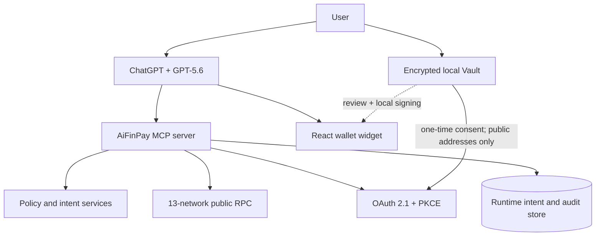

# AiFinPay Wallet for ChatGPT

<p align="center">
  
</p>

<p align="center"><strong>A non-custodial wallet interface and programmable approval layer for people and AI agents.</strong></p>

<p align="center">
  <a href="https://github.com/coinsecuritiescompany/GPT-wallet-AiFinPay/actions/workflows/ci.yml"></a>
  <a href="LICENSE"></a>
  <a href="https://aifinpay-wallet-chatgpt.onrender.com/health"></a>
  
</p>

> [!IMPORTANT]
> This public repository contains the reviewable AiFinPay Wallet beta. Balances and receive addresses are available across 13 mainnets (Casper requires a keyed RPC). Transfers are enabled only for configured EVM networks, require OAuth, a canonical preview and local Vault signing, and are rejected when the signed bytes differ from the reviewed transaction. Do not treat this beta as a bank, exchange, custodian or financial adviser.

## Try it

- [Product page](https://aifinpay-wallet-chatgpt.onrender.com/)
- [Widget preview](https://aifinpay-wallet-chatgpt.onrender.com/preview)
- [MCP endpoint](https://aifinpay-wallet-chatgpt.onrender.com/mcp)
- [Service health](https://aifinpay-wallet-chatgpt.onrender.com/health)
- [Privacy](https://aifinpay-wallet-chatgpt.onrender.com/privacy) · [Terms](https://aifinpay-wallet-chatgpt.onrender.com/terms) · [Support](https://aifinpay-wallet-chatgpt.onrender.com/support)

The checked-in production Blueprint uses an always-on Render service with persistent runtime storage. The currently hosted service must be updated from that Blueprint before it is treated as the production release.

## Product status

| Capability | Status | Trust boundary |
|---|---|---|
| Local 12/15-word wallet creation and restore | Beta | Recovery phrase stays in the browser Vault |
| Local AES-256-GCM encrypted Vault | Beta | Password and ciphertext remain on the device |
| EVM, Solana, NEAR, Aptos and Casper address derivation | Beta | OAuth tokens contain public addresses only |
| One-time ChatGPT connection and automatic dashboard opening | Beta | OAuth 2.1 authorization code flow with PKCE |
| 13-mainnet selector | Live | Every selected network returns read-only balances from public RPC (Casper via a key-gated node) |
| Public mainnet deployment registry | Declared, verification pending | 13 contract/program identifiers; wallet-transfer capability is gated separately per network |
| Native + USDC balances across all 13 mainnets | Live, read-only | Native token on all 13 (Casper CSPR via `query_balance` on a key-gated node); verified Circle USDC on 6 EVM chains (Polygon, Avalanche, Arbitrum, BNB, Base, Optimism) |
| Receive flow | Live | Casper-first network picker, QR code, full public address and one-tap copy |
| Cross-chain swap | Ready after provider key | Live ChangeNOW asset list, quote, explicit order confirmation, Vault-derived payout/refund addresses, deposit QR and status tracking |
| Agent policy engine and audit trail | Reference implementation | Server-side deterministic rules |
| Mainnet transaction signing | Polygon enabled by the production Blueprint | Per-network gate; OAuth, user review, local EIP-1559 signing and signed-byte validation |
| Mainnet broadcasting | Polygon enabled by the production Blueprint | The server accepts only a locally signed transaction that exactly matches the reviewed intent |

## Why AiFinPay

AI agents can call APIs, purchase data and complete workflows, but an unrestricted wallet key is not an acceptable payment interface. AiFinPay separates four responsibilities:

1. GPT-5.6 interprets the user's natural-language intent and selects a narrow MCP tool.
2. Deterministic code validates amounts, addresses, limits and policy rules.
3. The user keeps recovery material and signing authority in an encrypted local Vault.
4. The app returns concise structured results and a purpose-built interface inside ChatGPT.

The model can request an operation, but it cannot access recovery words or override the policy engine.

## Architecture


```mermaid
flowchart TD
    U["User"] --> C["ChatGPT + GPT-5.6"]
    C --> M["AiFinPay MCP server"]
    M --> P["Policy and intent services"]
    M --> R["13-network public RPC"]
    M --> A["OAuth 2.1 + PKCE"]
    M --> D[("Runtime intent and audit store")]
    C --> W["React wallet widget"]
    U --> V["Encrypted local Vault"]
    V -->|"one-time consent; public addresses only"| A
    V -. "review + local signing" .-> W
```

The monorepo contains a TypeScript MCP server, a compact React widget, a separately loaded Vault application and shared policy/schema packages. The ChatGPT widget excludes the heavier wallet-derivation libraries so it remains responsive on mobile. See [Architecture](docs/ARCHITECTURE.md), [Mainnet deployment registry](docs/MAINNET_DEPLOYMENTS.md) and [Public/private boundary](docs/PUBLIC_PRIVATE_BOUNDARY.md).

## Repository layout

```text
apps/
  mcp-server/       MCP tools, public routes, adapters and storage
  wallet-widget/    ChatGPT widget and separately bundled local Vault
packages/
  shared/           Schemas, types, amounts and network metadata
  aifinpay-adapter/ Policy engine and wallet adapter contract
  demo-ledger/      Deterministic test-only adapter
docs/               Architecture, security, deployment and submission docs
.github/             CI, dependency updates and contribution templates
```

## Local development

Requirements: Node.js 22+ (Node 24 recommended) and npm 11+.

```bash
npm ci
cp .env.example .env
npm run check
npm start
```

Local routes:

| Route | Purpose |
|---|---|
| `http://localhost:8787/mcp` | MCP endpoint |
| `http://localhost:8787/health` | Health and active adapter |
| `http://localhost:8787/preview` | Browser widget preview |
| `http://localhost:8787/vault` | Local non-custodial Vault |
| `http://localhost:8787/privacy` | Privacy notice |
| `http://localhost:8787/terms` | Beta terms |

Inspect the MCP server:

```bash
npx @modelcontextprotocol/inspector@latest --server-url http://localhost:8787/mcp --transport http
```

## Connect from ChatGPT

1. Open **Settings → Security and login** in ChatGPT and turn on **Developer mode**.
2. Open **ChatGPT Plugins**, select **+**, and create an `AiFinPay Wallet` connection to `https://aifinpay-wallet-chatgpt.onrender.com/mcp`.
3. Review the discovered tools, start a new conversation, add the connection from the tools menu, and ask: `Open my AiFinPay wallet`.
4. On first use only, choose **Connect**, create or restore the local Vault, and approve sharing its public addresses.
5. Future `Open my AiFinPay wallet` requests go directly to the same user-specific Vault dashboard until the app is disconnected in ChatGPT.

Every newly created Vault receives a fresh random recovery phrase and a new address set. The same connected user intentionally keeps that Vault across chats. Polygon, Arbitrum and the other EVM networks share one EVM address by standard account derivation; network selection still changes the chain ID, RPC balance, asset and smart-contract context.

Never paste a recovery phrase, private key, Vault password or API credential into ChatGPT, an issue, a screenshot or a tool input. Full instructions: [ChatGPT setup](docs/CHATGPT_SETUP.md).

## Configuration

The checked-in `.env.example` contains placeholders only. Read-only mainnet mode (all 13 networks) is the default; demo mode must be selected explicitly. Each network falls back to public RPC defaults and can be overridden with a `<NETWORK>_RPC_URLS` variable. Casper mainnet nodes are API-key gated: set `CASPER_RPC_URLS` and `CASPER_RPC_AUTH` (the provider key sent as the Authorization header) to enable CSPR balance reads.

```dotenv
AIFINPAY_WALLET_MODE=mainnet
POLYGON_RPC_URLS=https://polygon.drpc.org,https://polygon.publicnode.com
AIFINPAY_DEMO_MODE=false
DATABASE_URL=./data/aifinpay-local.sqlite
SESSION_SECRET=replace-with-at-least-32-random-characters
CHANGENOW_API_KEY=replace-with-a-server-side-partner-key
```

`AIFINPAY_DEMO_MODE=false` is mandatory for any shared deployment. The blockchain adapter is selected separately with `AIFINPAY_WALLET_MODE`.
`CHANGENOW_API_KEY` is required for live swap quotes and orders. It remains server-side and must be configured as a deployment secret.
The health endpoint exposes only `swapProvider: "configured" | "not_configured"` and never returns the credential.

## Security and privacy

- Recovery words are generated or entered only in the Vault page and are encrypted locally.
- User-specific tools require OAuth 2.1 with PKCE and separate read/write scopes; access and refresh tokens carry validated public addresses only.
- The MCP tool surface does not accept seed phrases, private keys, passwords or API keys.
- Mainnet reads use each network's official chain parameters and, where available, its verified Circle USDC contract (native token elsewhere).
- Financial values use integer base units rather than floating point.
- CSP domains are explicit and the ChatGPT widget makes no direct network requests.
- CI scans for accidentally committed keys, databases, archives and production configuration.

Read [Security policy](SECURITY.md), [Security model](docs/SECURITY_MODEL.md), [Threat model](docs/THREAT_MODEL.md), [Privacy](PRIVACY.md) and [Terms](TERMS.md).

## Public and private repositories

This repository remains public and contains the reviewable app, reference policy engine, UI, tests and documentation. It must never contain production credentials, customer data, treasury configuration, proprietary risk rules, production infrastructure state or signing material.

Private infrastructure can own proprietary risk rules, managed data services, internal monitoring, deployment secrets, customer integrations and confidential operating procedures. This public repository still owns the reviewable OAuth, local-signing, MCP and widget contracts. See [Public/private boundary](docs/PUBLIC_PRIVATE_BOUNDARY.md).

## OpenAI Build Week submission

This repository targets the **Apps for Your Life** track as a personal-finance ChatGPT app.

Devpost requires a working project, English submission materials, a public or reviewer-shared repository with relevant licensing, clear setup/testing instructions, a public YouTube demo of three minutes or less with voiceover, specific Codex/GPT-5.6 usage, and the primary `/feedback` Codex Session ID. The repository contains a [compliance checklist](docs/HACKATHON_COMPLIANCE.md), [submission draft](docs/DEVPOST_SUBMISSION.md), [demo script](docs/DEMO_SCRIPT.md) and [dated build log](docs/HACKATHON_BUILD_LOG.md).

### How Codex accelerated the build

Codex was used as an engineering collaborator throughout the primary build thread to:

- audit the initial empty repository and create the monorepo contract;
- research current Apps SDK and MCP requirements;
- implement and test the MCP server, React widget and local Vault;
- diagnose mobile bundle size and split the Vault from the inline widget;
- replace fabricated demo balances with read-only mainnet RPC data across all 13 networks;
- model security boundaries, run regression checks and prepare deployment;
- reconcile README, legal, security and submission documentation with actual behavior.

Key human product decisions included choosing non-custodial local recovery, requiring personal OAuth plus local review for every enabled transfer, using Polygon as the first signing-enabled network, extending balances and receiving across 13 mainnets, and keeping confidential production systems outside the public repository.

GPT-5.6 is the conversational orchestration layer: it interprets wallet requests, selects the appropriate MCP tool and explains deterministic results. It is not the source of truth for policy, balances or transaction authorization.

> [!NOTE]
> The Devpost form still requires the repository owner to add the public YouTube URL and the `/feedback` Codex Session ID. These values are intentionally not invented or exposed here.

## Quality gates

```bash
npm run lint
npm run typecheck
npm test
npm run build
npm run security:public
npm audit --audit-level=high --omit=dev
```

## Community and governance

- [Contributing](CONTRIBUTING.md)
- [Code of Conduct](CODE_OF_CONDUCT.md)
- [Governance](GOVERNANCE.md)
- [Roadmap](ROADMAP.md)
- [Changelog](CHANGELOG.md)
- [Support](SUPPORT.md)

## Legal

The source code is available under the [MIT License](LICENSE). Third-party packages remain governed by their respective licenses; see [Third-party licenses](docs/THIRD_PARTY_LICENSES.md).

The software license is not a banking, money-transmission, virtual-asset, custody or securities license. No regulatory authorization is claimed by this repository. See [Compliance posture](docs/COMPLIANCE.md).

---

AiFinPay is an independent project and is not affiliated with or endorsed by OpenAI, Polygon Labs, Circle, Stripe, PayPal or Visa. Third-party names are used only to identify interoperable platforms and technologies.
