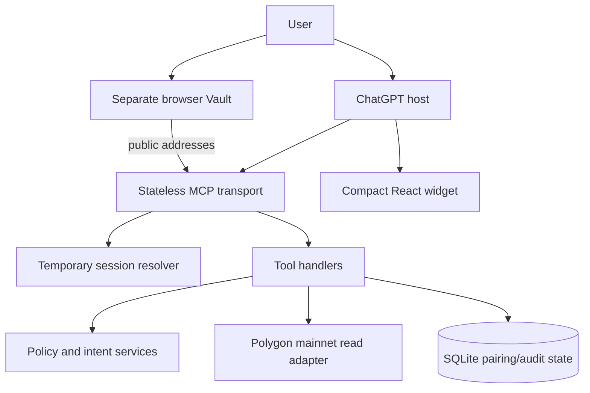
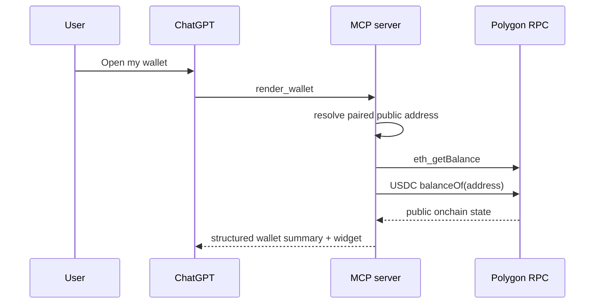

# Architecture

## System view

## Build split

The ChatGPT widget and Vault are separate single-file bundles:

- `dist/index.html` contains wallet display and interaction code only;
- `dist-vault/vault.html` contains wallet derivation and encryption dependencies.

This keeps the inline mobile widget small while loading cryptographic code only when the user intentionally opens the Vault page.

## Mainnet read flow

RPC reads use fallbacks and a short in-memory cache. The native Polygon USDC contract and chain metadata are defined in the shared package. No private key is present in this flow.

## Vault pairing flow

1. `create_wallet_pairing` stores only a hash of a random, short-lived token.
2. The user opens `/vault?pair=...` outside the ChatGPT widget.
3. The browser creates/restores the Vault locally and derives public addresses.
4. `/api/vault/pair` validates the token and address formats.
5. The server marks the token consumed and stores public addresses for the current temporary session.

Recovery words, Vault password and decrypted signing material are not part of the pairing request.

## Trust boundaries

1. **Model:** can choose a tool but cannot access local recovery material or determine authoritative policy output.
2. **Widget:** receives scoped structured content and uses the MCP bridge for named actions.
3. **Vault:** owns recovery, derivation and future signing on the user's device.
4. **Server:** validates tool input and stores only public addresses plus reference metadata.
5. **RPC:** supplies untrusted public chain data; fallbacks improve availability but are not a cryptographic quorum.
6. **Private production system:** future authentication, durable storage and signing orchestration stay outside the public repository.

## Current write boundary

Mainnet `prepare_transfer` and `confirm_transfer` return a security error. Demo mode can exercise intent, policy, confirmation and receipt flows against a deterministic test ledger. Real-chain transaction construction, user review, local signing and broadcasting remain future security-gated work.
