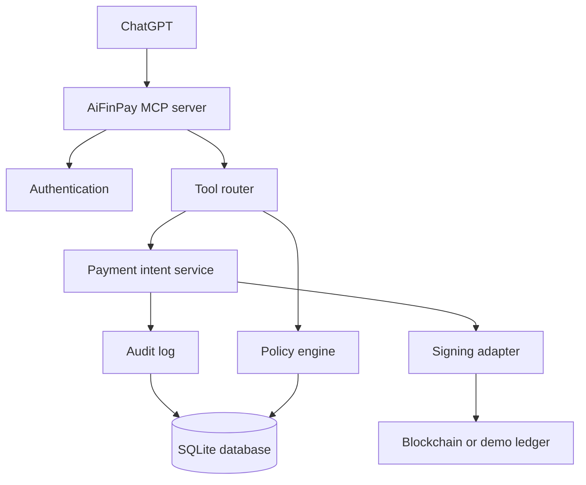
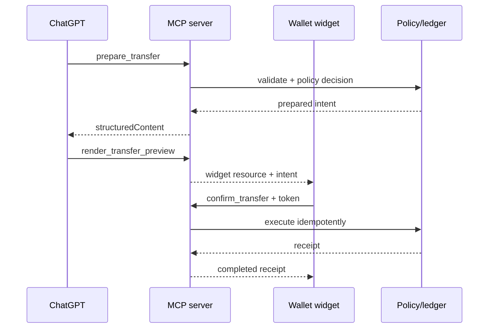

# Architecture

## Trust boundaries

1. **Model boundary:** ChatGPT can request tools but cannot invent a valid confirmation token or override policy output.
2. **Widget boundary:** the sandboxed iframe receives only structured/widget data and calls named tools through the host bridge.
3. **Session boundary:** wallet ownership is resolved server-side. Model-provided wallet IDs are ignored.
4. **Signing boundary:** the demo adapter simulates signing. A production adapter must isolate keys in user-controlled signing, WalletConnect, HSM or MPC.
5. **Persistence boundary:** SQLite stores metadata, intents, policies and audit hashes; never private keys.

## Data flow

- Inputs are parsed by Zod and financial strings are converted to base-unit `bigint`.
- Policy decisions are deterministic code outputs.
- A prepared intent is bound to user, recipient, amount, network, expiry and idempotency key.
- Explicit confirmation provides an HMAC token issued for that exact intent and user.
- Execution is checked against the state machine and adapter transaction state before returning a receipt.

