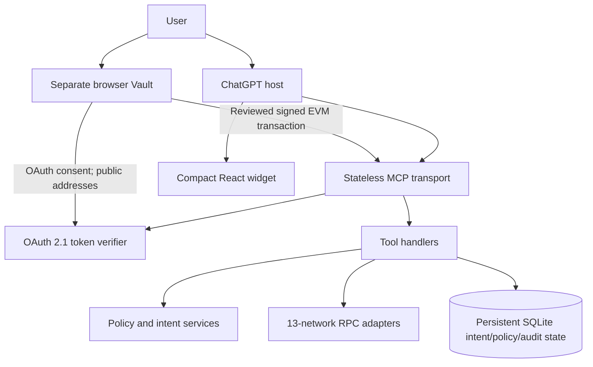
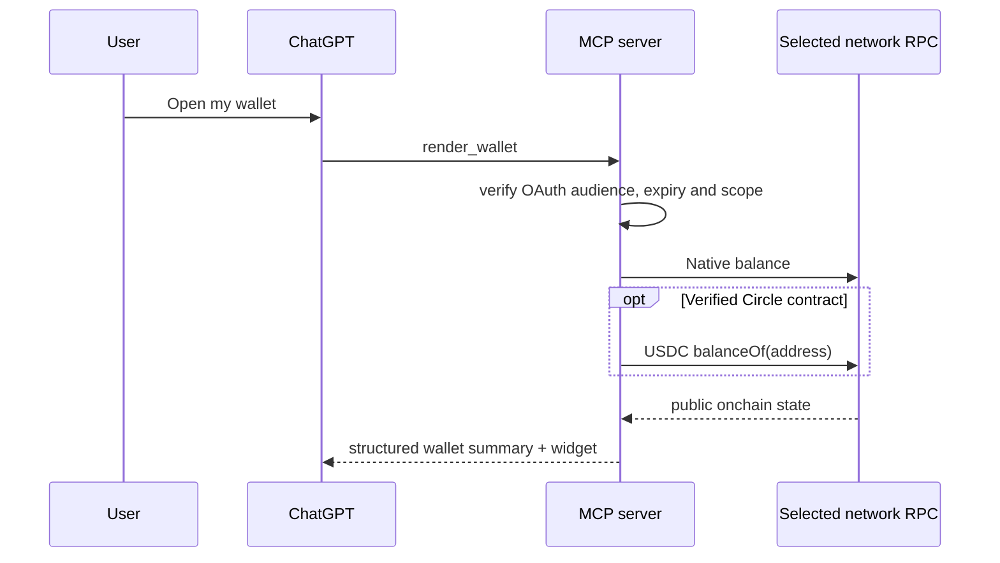

# Architecture

## System view

```mermaid
flowchart TD
    U["User"] --> C["ChatGPT host"]
    C --> M["Stateless MCP transport"]
    M --> A["OAuth 2.1 token verifier"]
    M --> T["Tool handlers"]
    T --> P["Policy and intent services"]
    T --> R["13-network RPC adapters"]
    T --> S[("Persistent SQLite intent/policy/audit state")]
    C --> W["Compact React widget"]
    U --> V["Separate browser Vault"]
    V -->|"OAuth consent; public addresses"| A
    V -->|"Reviewed signed EVM transaction"| M
```

## Build split

The ChatGPT widget and Vault are separate single-file bundles:

- `dist/index.html` contains wallet display and interaction code only;
- `dist-vault/vault.html` contains wallet derivation and encryption dependencies.

This keeps the inline mobile widget small while loading cryptographic code only when the user intentionally opens the Vault page.

## Mainnet balance flow

```mermaid
sequenceDiagram
    participant U as User
    participant C as ChatGPT
    participant M as MCP server
    participant R as Selected network RPC
    U->>C: Open my wallet
    C->>M: render_wallet
    M->>M: verify OAuth audience, expiry and scope
    M->>R: Native balance
    opt Verified Circle contract
      M->>R: USDC balanceOf(address)
    end
    R-->>M: public onchain state
    M-->>C: structured wallet summary + widget
```

RPC reads use fallbacks and a short in-memory cache. Chain-specific native assets, USDC addresses and decimals are defined in the shared package. No private key is present in this flow.

## One-time Vault authorization flow

1. An unauthenticated wallet tool declares `wallet:read` and returns an MCP OAuth challenge.
2. ChatGPT starts an OAuth 2.1 authorization-code flow with PKCE and opens `/vault?oauth=...`.
3. The browser creates/restores the Vault locally and derives public addresses.
4. The user explicitly approves sharing those public addresses with ChatGPT.
5. The server returns a short-lived, PKCE-bound authorization code. ChatGPT exchanges it for a one-hour access token and a renewable token.
6. Later chats attach the access token, so `render_wallet` returns the dashboard directly. The token carries public addresses only.

Recovery words, Vault password, encrypted ciphertext and decrypted signing material are not part of the OAuth request or token.

## Trust boundaries

1. **Model:** can choose a tool but cannot access local recovery material or determine authoritative policy output.
2. **Widget:** receives scoped structured content and uses the MCP bridge for named actions.
3. **Vault:** owns recovery, derivation, transaction review and signing on the user's device.
4. **Server:** validates tool input, stores public addresses and runtime metadata, and broadcasts only a signed transaction that exactly matches its reviewed intent.
5. **RPC:** supplies untrusted public chain data; fallbacks improve availability but are not a cryptographic quorum.
6. **Operator:** owns deployment secrets, backups, monitoring, incident response and jurisdictional obligations.

## EVM transfer boundary

1. `prepare_transfer` validates the selected chain asset, policy, current balance and estimated maximum gas.
2. `confirm_transfer` records explicit approval and issues a short-lived Vault URL.
3. The Vault fetches the exact unsigned EIP-1559 transaction and shows the recipient, asset, amount, chain and fee ceiling.
4. The user unlocks the local Vault and signs in the browser.
5. A short-lived HMAC token binds submission to the exact reviewed fields.
6. The server decodes the signed transaction, recovers the signer, compares all authoritative fields and only then calls the selected RPC broadcast method.

The production Blueprint enables Polygon only. Other EVM networks stay balance-only until release-tested; non-EVM signing is not implemented.
